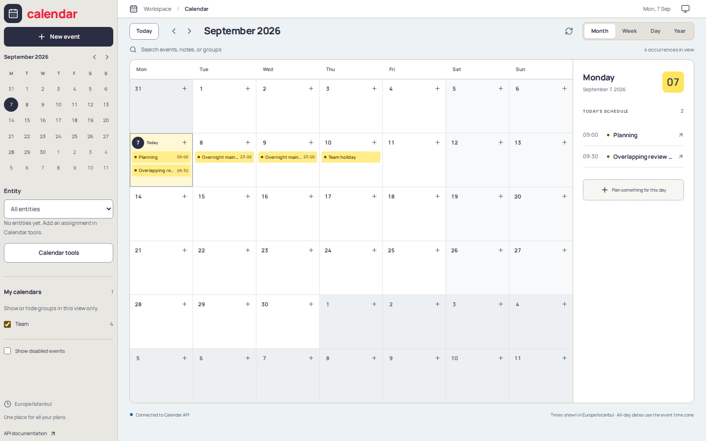

# Calendar 🗓️

[](https://raw.githubusercontent.com/rakunlabs/calendar/main/LICENSE)
[](https://sonarcloud.io/summary/overall?id=rakunlabs_calendar)
[](https://github.com/rakunlabs/calendar/actions)
[](https://rakunlabs.github.io/calendar/)

Calendar is a self-hosted calendar and holiday service with a browser-based management
UI, a Go API, and iCalendar (ICS) support. Plan events, maintain recurring holidays,
organize calendars for different entities, and share feeds with calendar clients.



## Features

- Month, week, day, and year views with a selected-day agenda and mobile layout.
- Create, edit, and delete all-day or timed events with explicit time zones.
- Daily, weekly, monthly, and yearly recurrence, plus special holiday rules.
- Organize events into groups and assign groups or individual events to entities.
- Import ICS files, download calendars, and copy subscription URLs with explicit scope.
- An embedded UI served by the Go binary; no frontend runtime server is needed in production.

**Start here:** [Quickstart](https://rakunlabs.github.io/calendar/quickstart) ·
[User guide](https://rakunlabs.github.io/calendar/ui-guide) ·
[Releases](https://github.com/rakunlabs/calendar/releases/latest) ·
[UI development](_ui/README.md)

PostgreSQL is required. The service runs database migrations on startup.
The UI and API have **no built-in authentication**: protect them at deployment.
The optional `Updated by` / `X-User` value is an audit label, not a verified identity
or an access control mechanism. Entity filters and subscription URLs do not restrict access.

## Development

Run these commands from the repository root. You need Go matching `go.mod`,
Docker with Compose, Node.js 22, and pnpm (the version is pinned in `_ui/package.json`).
Use `make` to list available targets.

```sh
# Start the local PostgreSQL development database on port 5432.
make env
# Install/build the UI and run Go using the checked-in calendar.yaml.
make run
```

Open **http://localhost:8080/calendar/**. Configuration is read from
`calendar.[toml|yaml|yml|json]` in the current directory, or the path in `CONFIG_FILE`.

> The Compose database uses trust authentication and is for local development only.
> Do not expose it to untrusted networks. `make env-down` runs Compose with
> `--volumes`, removing the local database volumes and their data.

For UI development, run `make ui-dev` alongside the Go service. Vite's development
URL is http://localhost:5173/calendar/ and API calls are proxied to port 8080.
See [`_ui/README.md`](_ui/README.md) for build, test and timezone details.

## References

- https://datatracker.ietf.org/doc/html/rfc5545
- https://en.wikipedia.org/wiki/List_of_tz_database_time_zones
- https://en.wikipedia.org/wiki/ISO_3166-1_alpha-3
- https://www.thunderbird.net/en-US/calendar/holidays/
- https://calendars.icloud.com/holidays/tr_tr.ics/
- https://github.com/ics-tools/viewer
